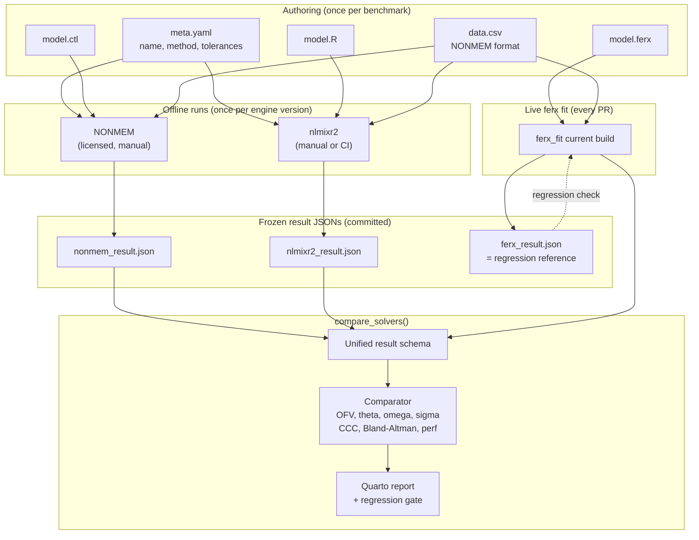

# ferx benchmark & cross-solver validation — phased plan

A reproducible NONMEM / nlmixr2 / ferx comparison suite, landed in small
reviewable PRs. Lives in the [InsightRX/ferx](https://github.com/InsightRX/ferx)
repo (companion to [PR #33](https://github.com/InsightRX/ferx/pull/33), which is
the prototype this plan distills).

## Core principle

**Don't translate models between engines. Compare results.**

Each benchmark consists of three independently authored model files (one per
engine), one shared dataset, and three result JSONs. The benchmark suite is an
ingestor + comparator, not a translator. This avoids two failure modes that
killed the prototype:

1. A custom ferx parser drifting from the real Rust parser.
2. Hand-written ferx→NONMEM / ferx→nlmixr2 transpilers silently producing
   different mathematical models.

NONMEM and nlmixr2 results are **frozen artifacts** keyed to an engine version.
Re-run them only when you bump that engine's pinned version.

---

## End-to-end flow



The dotted arrow is the only thing that runs on CI in the default path. NONMEM
runs are gated behind licensing; nlmixr2 runs are gated behind a manual
`workflow_dispatch`.

---

## What the comparison does

For each benchmark × solver, the comparator produces:

| Comparison | Metric | Why |
|---|---|---|
| Convergence | bool | A solver that doesn't converge can't be compared |
| Objective function | ΔOFV (absolute) | NONMEM convention; relative diff breaks near zero |
| Fixed effects (θ) | per-param relative error vs reference | Catches structural translation/scaling bugs |
| Random effects (Ω) | per-diagonal relative error | Catches IIV miscoding |
| Residual error (Σ) | relative error | Catches error-model misinterpretation |
| Cross-solver agreement | Lin's CCC, Pearson r | Single number for "do these solvers agree" |
| Prediction agreement | Bland-Altman on IPRED | Catches magnitude-dependent bias |
| Performance | wall time, n function evals | Solver efficiency tracking |

### Example comparison table (one benchmark, three solvers)

```
benchmark: warfarin_focei                       reference: nonmem 7.5.1

  parameter    nonmem      ferx     Δ%    nlmixr2     Δ%   tol
  ─────────────────────────────────────────────────────────────
  TVCL          0.134     0.135   +0.7      0.138   +3.0   5%
  TVV           8.10      8.05    -0.6      8.21    +1.4   5%
  TVKA          1.00      0.98    -2.0      1.04    +4.0   5%
  ETA_CL (ω²)   0.090     0.091   +1.1      0.087   -3.3   10%
  ETA_V  (ω²)   0.050     0.051   +2.0      0.048   -4.0   10%
  PROP_ERR      0.040     0.040    0.0      0.041   +2.5   10%

  OFV          -1037.79  -1037.81  Δ=-0.02  -1037.65 Δ=+0.14
  CCC vs ref       —      0.9998             0.9991
  wall time      18.2s     2.1s    8.7×     34.5s    0.5×
  n func eval     312       89               412
  status:                  PASS              PASS
```

Cells outside tolerance get a `!` marker; failures show up red in the Quarto
report.

---

## Phased plan

### Phase 1 — Minimal comparator

**Goal:** ingest pre-computed results from three solvers, produce one
side-by-side table for one bundled example.

**Keep from [PR #33](https://github.com/InsightRX/ferx/pull/33):**

| File | What to keep | What to drop |
|---|---|---|
| [`R/benchmark.R`](https://github.com/InsightRX/ferx/blob/claude/sleepy-napier-1d042d/R/benchmark.R) | `.list_benchmark_models`, `.read_meta`, `.hash_file`, `.ferx_versions`, `.nlmixr2_versions`, `parse_nonmem_versions`, `count_func_evals_nonmem`, `.count_func_evals_ferx` | `run_benchmarks` for now (Phase 2); `.compare_to_reference` (rewrite with abs-ΔOFV) |
| [`R/benchmark_compare.R`](https://github.com/InsightRX/ferx/blob/claude/sleepy-napier-1d042d/R/benchmark_compare.R) | `compare_solvers` *structure*, `concordance_cc`, `bland_altman_stats`, `.build_*_table` helpers | The inline ferx_fit / inline nlmixr2 runs — Phase 1 reads frozen JSONs only |
| [`R/transpile_nonmem.R`](https://github.com/InsightRX/ferx/blob/claude/sleepy-napier-1d042d/R/transpile_nonmem.R) | `ingest_nonmem_results`, `save_nonmem_results`, `.parse_nonmem_ext`, `.parse_nonmem_runtime` | Everything else (`ferx_to_nonmem`, all DSL parsing, `$PK` / `$DES` / `$ERROR` builders) |
| [`R/transpile_nlmixr2.R`](https://github.com/InsightRX/ferx/blob/claude/sleepy-napier-1d042d/R/transpile_nlmixr2.R) | `.nlmixr2_fit_to_result` (rename to `ingest_nlmixr2_fit`), `count_func_evals_nlmixr2` | Everything else (script generation, model construction, analytical PK builders) |
| [`inst/benchmarks/models/warfarin_focei/meta.yaml`](https://github.com/InsightRX/ferx/blob/claude/sleepy-napier-1d042d/inst/benchmarks/models/warfarin_focei/meta.yaml) | Schema and tag set | Fix `../../../examples/...` paths — copy files into the benchmark dir |
| [`inst/benchmarks/WORKFLOW.md`](https://github.com/InsightRX/ferx/blob/claude/sleepy-napier-1d042d/inst/benchmarks/WORKFLOW.md) | Most of the prose | Sections about `ferx_to_nonmem`, `ferx_to_nlmixr2` |

**New work in Phase 1:**

1. **Unified result schema** — one JSON shape, documented in
   `inst/benchmarks/SCHEMA.md`. Every ingestor must conform.
2. **Directory layout** — self-contained per benchmark:
   ```
   inst/benchmarks/models/<name>/
     meta.yaml
     model.ferx
     model.ctl
     model.R
     data.csv
     reference/
       ferx_result.json
       nonmem_result.json
       nlmixr2_result.json
   ```
3. **`compare_solvers(name)`** that reads all `reference/*.json` for a model
   and the current ferx fit, emits the comparison object.
4. **One canonical bundled benchmark** — `warfarin_focei` with all three result
   JSONs committed. Proves the path works end-to-end.
5. **Schema validation test** — every committed `*_result.json` must validate
   against the schema; CI fails otherwise.

**Guardrails added in Phase 1:**

- **`benchmark_hash` mismatch warning.** `meta.yaml` declares a `benchmark_hash`
  (hash of meta + the three model files + dataset header). Each result JSON
  records the hash it was computed against. Comparator refuses to compare
  results with mismatched hashes unless `--allow-stale` is set; emits a clear
  "re-run NONMEM/nlmixr2 because the model changed" message.
- **Engine-version pinning.** `meta.yaml` declares
  `engine_versions: { nonmem: "7.5.1", nlmixr2: "3.0.1", rxode2: "2.1.0" }`.
  Each result JSON records its actual versions. Mismatch → warning in report,
  never silent.
- **No-reference is a failure, not a skip.** Adding a model without committing
  result JSONs fails CI with "missing reference for solver X."
- **Per-parameter tolerance** in `meta.yaml`:
  ```yaml
  tolerances:
    theta_default: 0.05
    omega_default: 0.10
    sigma_default: 0.10
    ofv_abs: 1.0      # ΔOFV; absolute, not relative
    per_param:
      TVKA: 0.10      # KA recovers less precisely; relax
  ```
- **Schema-validated result JSONs.** Wrong shape → fails on commit.

**Deliverable:** one PR, ~600 LoC, reviewable in an afternoon. No transpilers,
no parser, no Quarto, no robustness, no CI workflows. Just: ingest three JSONs
and the live ferx fit, print one table.

---

### Phase 2 — Report + regression gate

1. **Quarto report.** Keep
   [`inst/benchmarks/report.qmd`](https://github.com/InsightRX/ferx/blob/claude/sleepy-napier-1d042d/inst/benchmarks/report.qmd)
   mostly intact — it already consumes `compare_solvers()` output cleanly.
2. **`run_benchmarks()`** — fits every model with current ferx, diffs against
   `ferx_result.json`, fails on out-of-tolerance. Lives in `R/benchmark.R`.
3. **Fix Phase-1-blocking bugs** from the prototype before this lands:
   - `.rb_summarise` uses `isTRUE(run_df$converged)` — `isTRUE` on a vector
     returns `FALSE`. Real bug, silent. Replace with
     `run_df$converged & !is.na(run_df$ofv)`.
   - `run_benchmarks(update_refs = TRUE)` collapses regression check + reference
     update into one code path. Split into `update_reference()` (explicit,
     writes JSON, no comparison) and `run_benchmarks()` (read-only, never
     writes). No flag to combine them.
   - OFV uses relative tolerance — switch to absolute (`abs(ofv - ref$ofv) < ofv_abs`).
   - `no_reference` returning `pass = NA` and the test treating it as skip —
     change to hard failure.
4. **`benchmark_hash` and engine-version checks wired through** to
   `compare_solvers` and `run_benchmarks` (defined in Phase 1, enforced here).

---

### Phase 3 — Robustness + perf history

1. **`benchmark_robustness()`** — keep from
   [`R/benchmark_robustness.R`](https://github.com/InsightRX/ferx/blob/claude/sleepy-napier-1d042d/R/benchmark_robustness.R)
   after fixing:
   - The `isTRUE` vector bug (above).
   - The `.rb_write_temp_model` mini-transpiler — it writes a fresh `.ferx`
     from regex-parsed sections, which re-introduces the parser drift problem.
     Replace with: invoke ferx with init-value overrides (CLI flag or env var)
     so the original model file is never re-serialized.
2. **`perf_history.csv`** append-on-run, gitignored. Keep from
   [`save_perf_history`](https://github.com/InsightRX/ferx/blob/claude/sleepy-napier-1d042d/R/benchmark_compare.R).
3. **Per-method tolerance.** SAEM legitimately moves more than FOCEI; the
   per-parameter tolerance table from Phase 1 already supports this.

---

### Phase 4 — Automation

1. **PR coverage checker workflow.** Keep
   [`.github/workflows/benchmark-suggest.yml`](https://github.com/InsightRX/ferx/blob/claude/sleepy-napier-1d042d/.github/workflows/benchmark-suggest.yml)
   and [`inst/benchmarks/suggest_benchmarks.R`](https://github.com/InsightRX/ferx/blob/claude/sleepy-napier-1d042d/inst/benchmarks/suggest_benchmarks.R)
   nearly as-is. Now meaningful because Phases 1–3 exist.
2. **Manual `workflow_dispatch` for nlmixr2 re-runs.** Keep
   [`.github/workflows/nlmixr2-benchmark.yml`](https://github.com/InsightRX/ferx/blob/claude/sleepy-napier-1d042d/.github/workflows/nlmixr2-benchmark.yml).
   Strip the inline model construction — it should call `ingest_nlmixr2_fit()`
   on a `model.R` that already exists in the benchmark directory.
3. **No NONMEM CI** — licensing. Document the offline procedure in
   `WORKFLOW.md`.

---

### Phase 5 (optional, much later) — Transpilers in ferxtranslate

If maintaining three native model files per benchmark becomes painful, *then*
add transpilers — and put them in **ferxtranslate**, not ferx:

- `ferxtranslate::ferx_to_nonmem()` — companion to the existing `nm_to_ferx()`.
- `ferxtranslate::ferx_to_nlmixr2()` — companion to a future `nlmixr2_to_ferx()`.

The benchmark suite still consumes whatever's in `model.ctl` / `model.R` as
authoritative — a transpiler bug never corrupts a comparison. Bonus: this gives
you a round-trip test for free (translate NONMEM→ferx→NONMEM, diff the ASTs).

---

## Scaling from 1 to N models

### Adding a benchmark (one-time cost per model)

```
  ┌─────────────────────────────────────────────────────┐
  │ 1. Author meta.yaml + model.{ferx, ctl, R} + data   │
  │ 2. Run ferx locally:    update_reference(name)      │
  │ 3. Run NONMEM offline:  save_nonmem_results(...)    │
  │ 4. Run nlmixr2 (CI or local): commits JSON          │
  │ 5. PR adds the directory + three result JSONs       │
  │ 6. CI validates schema + benchmark_hash             │
  └─────────────────────────────────────────────────────┘
```

The three external runs happen *once per engine version*. They produce
artifacts committed to the repo. Re-running is only needed when:
- The benchmark itself changes (`benchmark_hash` mismatch — caught automatically).
- A pinned engine version bumps (`engine_versions` change — caught automatically).

### Cost per added model

| Step | Time | Frequency |
|---|---|---|
| Authoring 3 model files + meta | 30–60 min | once per benchmark |
| Local ferx fit + commit reference | 1 min | once per ferx-nlme version |
| Offline NONMEM run + JSON commit | 5–30 min | once per NONMEM version |
| nlmixr2 run via workflow_dispatch | 5–15 min | once per nlmixr2 version |
| Subsequent comparisons | seconds | every PR |

This is the right shape: **high one-time cost, near-zero recurring cost** —
exactly the inverse of running NONMEM in CI on every PR (which is infeasible
anyway due to licensing).

### Target benchmark coverage

Phase 1 ships with 1 model (warfarin_focei). Subsequent additions, roughly one
per logical PR:

| Benchmark | Tests | Priority |
|---|---|---|
| `warfarin_focei` | basic 1-cpt oral, FOCEI | Phase 1 |
| `warfarin_foce` | same model, FOCE | next |
| `warfarin_saem` | same model, SAEM (different convergence behaviour) | next |
| `two_cpt_iv_focei` | 2-cpt analytical | early |
| `two_cpt_oral_cov_focei` | covariates + allometric | mid |
| `mm_oral_focei` | Michaelis-Menten ODE | mid |
| `warfarin_iov_focei` | IOV / kappa | when IOV ships |
| `<name>_bloq_focei` | M3 method | when BLOQ ships |
| `<name>_correlated_etas` | full Ω | when full-Ω ships |

Cap is roughly 10–15 benchmarks. Past that you're paying the authoring tax for
diminishing marginal coverage. The PR coverage checker (Phase 4) keeps the suite
honest: a PR claiming to add a feature gets pinged if no benchmark covers it.

---

## Guardrails summary

| Guardrail | Phase | What it catches |
|---|---|---|
| Unified result schema + validation | 1 | Malformed result JSONs |
| `benchmark_hash` per result | 1 | Stale NONMEM/nlmixr2 results after model edit |
| `engine_versions` per result | 1 | Stale results after engine version bump |
| `no_reference` is a hard failure | 1 | Adding a model without committing references |
| Per-parameter tolerance | 1 | One-size-fits-all over/under-strict thresholds |
| Absolute ΔOFV (not relative) | 1 | OFV near zero producing meaningless rel-diff |
| `update_reference()` separate from `run_benchmarks()` | 2 | Accidentally overwriting regressions |
| Fix `isTRUE(vec)` bug | 2/3 | Silent zero-row summary |
| Robustness perturbation via CLI overrides, not re-serialization | 3 | Custom-parser drift |
| PR coverage checker | 4 | Features landing without benchmark coverage |

---

## What's deliberately not in scope

- **Translators (ferx ↔ NONMEM ↔ nlmixr2)** — Phase 5 only, in ferxtranslate,
  optional even then.
- **Custom ferx parser** — never. Ingest result files, not model files.
- **NONMEM in CI** — licensing.
- **Publishing the report** — always local. The report.qmd renders to a local
  HTML; sharing it is a human decision.
- **Auto-tuning tolerances** — manual per-param tolerance in `meta.yaml` is
  enough. Don't build a calibration system.
